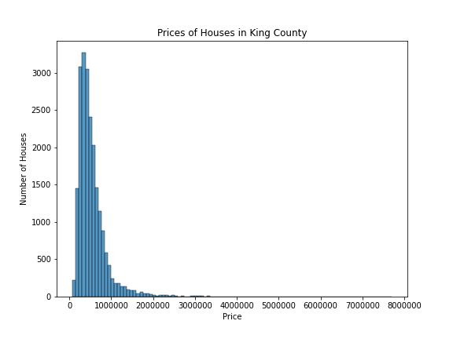
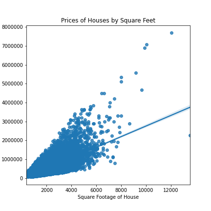
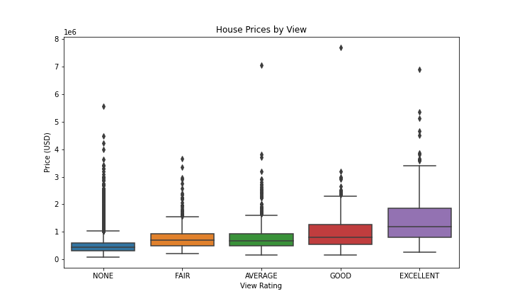
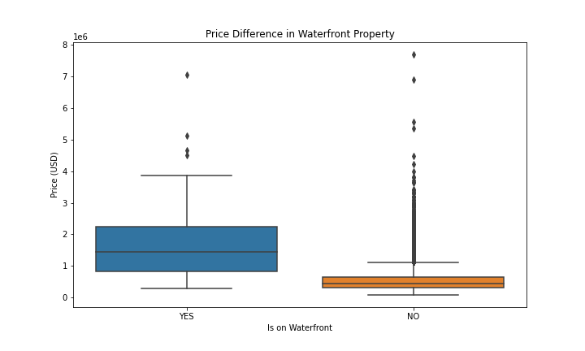

# King County Regression Analysis

##### Author: Spencer Hadel
***
## Overview

In order to help a new real estate company in King County, we will use analyis of recent house sales data to inform  decisions on how to accurately assess the value of a given property for future buyers and sellers. Using key points of data from other house sales, we will help the new company utilize a more data-driven approach than competitors. With the help of this analysis, the company will be able to determine what features of a property have the most statistically significant impact on it's value, and what steps can be taken going forward to accurately price houses in the area.

## Data
This analysis utilizes over 21,000 pieces of sales data from [kc_house_data.csv](./data/kc_house_data.csv). This data was collected from house sales in King County from 2014-2015, and included the following features:

* `id` - Unique identifier for a house
* `date` - Date house was sold
* `price` - Sale price (prediction target)
* `bedrooms` - Number of bedrooms
* `bathrooms` - Number of bathrooms
* `sqft_living` - Square footage of living space in the home
* `sqft_lot` - Square footage of the lot
* `floors` - Number of floors (levels) in house
* `waterfront` - Whether the house is on a waterfront
  * Includes Duwamish, Elliott Bay, Puget Sound, Lake Union, Ship Canal, Lake Washington, Lake Sammamish, other lake, and river/slough waterfronts
* `view` - Quality of view from house
  * Includes views of Mt. Rainier, Olympics, Cascades, Territorial, Seattle Skyline, Puget Sound, Lake Washington, Lake Sammamish, small lake / river / creek, and other
* `condition` - How good the overall condition of the house is. Related to maintenance of house.
  * See the [King County Assessor Website](https://info.kingcounty.gov/assessor/esales/Glossary.aspx?type=r) for further explanation of each condition code
* `grade` - Overall grade of the house. Related to the construction and design of the house.
  * See the [King County Assessor Website](https://info.kingcounty.gov/assessor/esales/Glossary.aspx?type=r) for further explanation of each building grade code
* `sqft_above` - Square footage of house apart from basement
* `sqft_basement` - Square footage of the basement
* `yr_built` - Year when house was built
* `yr_renovated` - Year when house was renovated
* `zipcode` - ZIP Code used by the United States Postal Service
* `lat` - Latitude coordinate
* `long` - Longitude coordinate
* `sqft_living15` - The square footage of interior housing living space for the nearest 15 neighbors
* `sqft_lot15` - The square footage of the land lots of the nearest 15 neighbors

## Methods
This anaylsis first cleans the data present in kc_house_data to remove null values, outliers, and oddities. It then explores the relationship between each of the features on house price, creating visualizations to better understand the effect of these features. 

Next, it preprocesses the data, including normalizing the data so that the model can be properly trained on varying ranges of data, and dividing categorical features into useable variables.

Finally, the analysis creates multiple Linear Regression models in order to find the best fitting model. By splitting the data into training and testing sets (75% and 25% of the original dataset, respectively), the best regression model will be able to assess house value and which features add or subtract from that value, according to it's training data.

## Results
The analysis revealed a few key points about house sale prices in the area. First of all, we can see clearly what most houses in the area are priced at with a simple distribution plot.



This shows us that most houses in King County are valued below $1 million. Additionally, we can see what features have a strong correlation with house value overall, such as square footage, quality of view, number of bed and bathrooms, and whether the property is on a waterfront.







## Conclusion
words

## More Information
The full analysis can be found in three Jupyter Notebooks: [Jupyter Notebook](./________________.ipynb). Further business conclusions can be found in the [presentation](./______________________.pdf).

## Repository Structure

```
├── data
├── images
├── README.md
├── _____________.pdf
├── _____________.ipynb
├── _____________.ipynb
└── _______________.ipynb
```
